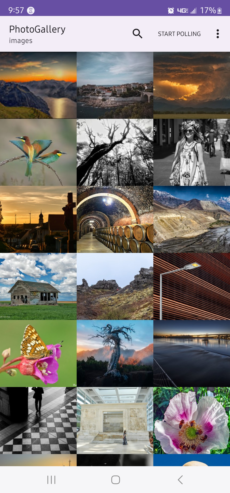
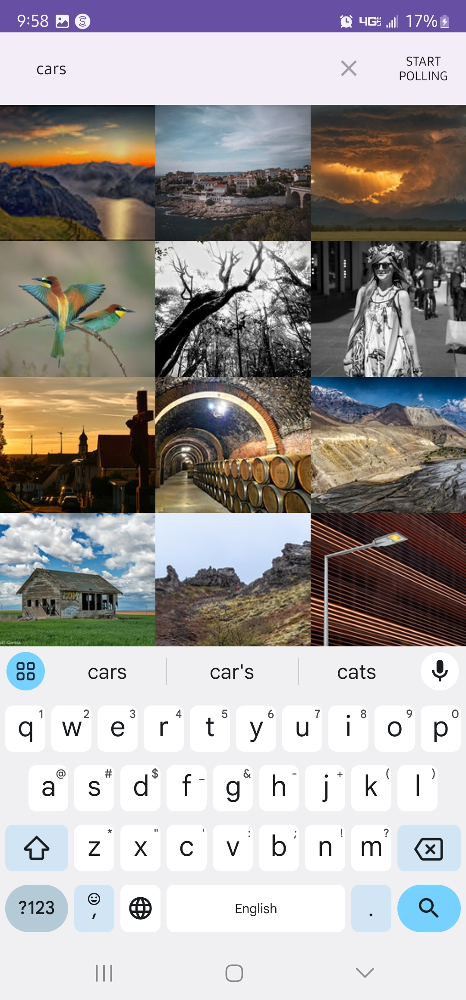
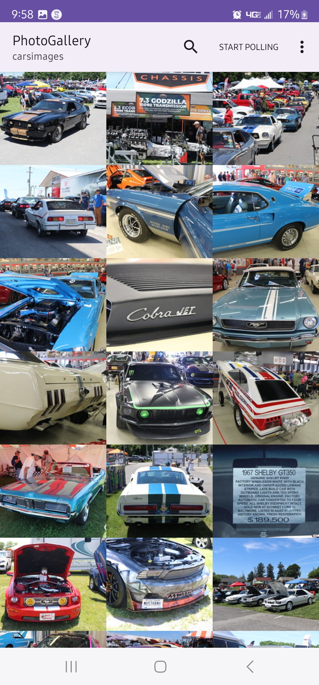
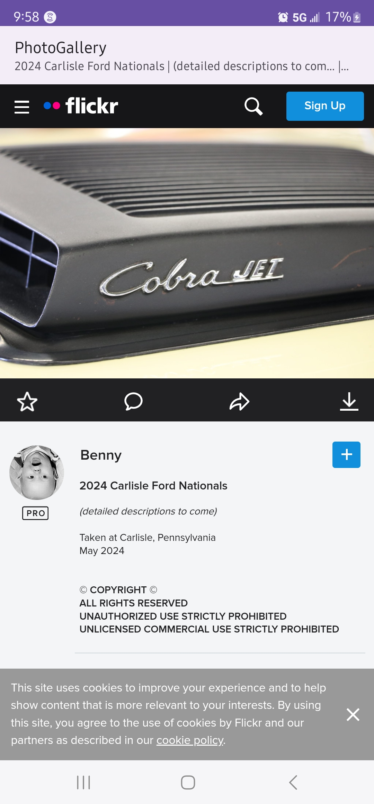
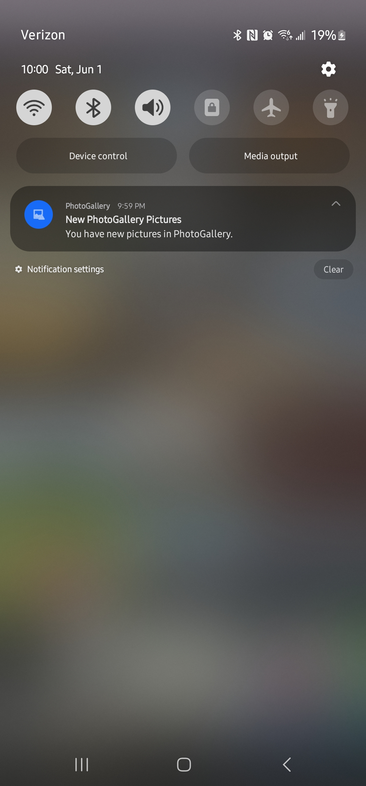

# PhotoGallery Application
- A gallery app fetching interesting images from Flickr API.
- User can search images and can see flickr page of that image when clicked.
- Storing search query in datastore and fetching latest images periodically.
- Notifying users when there are any new images in latest batch of fetch.
- User can toggle polling (On/Off the background fetching process).
- This is a practice application made with the help of text book [Android Programming: The Big Nerd Ranch Guide (5th Edition)](https://bignerdranch.com/books/android-programming-the-big-nerd-ranch-guide-5th-edition/).

## Main topics learnt through this project
- Fetching content from a REST API (Here, Flickr API) in Json format using Retrofit.
- Exploring and deserializing Json data and showing images in grid view.
- Search functionality using search action view in action bar.
- Using DataStore to store search keyword and prepopulating the word in search view next time.
- Exploring WorkManager to fetch images for every 15 minutes.
- NotificationBuilder to notify users if new images are there.
- Exploring WebView and ways to display URI in browser.
- Back button functionality in webview to use webview's browsing history.

## Screenshots

&emsp;&emsp;&emsp;&emsp;
 
 
&emsp;&emsp;
